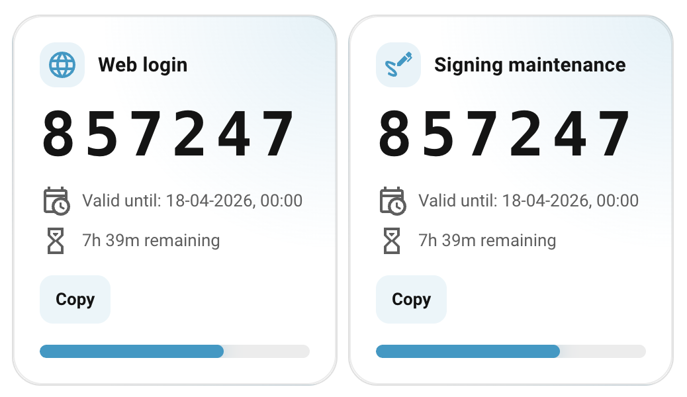
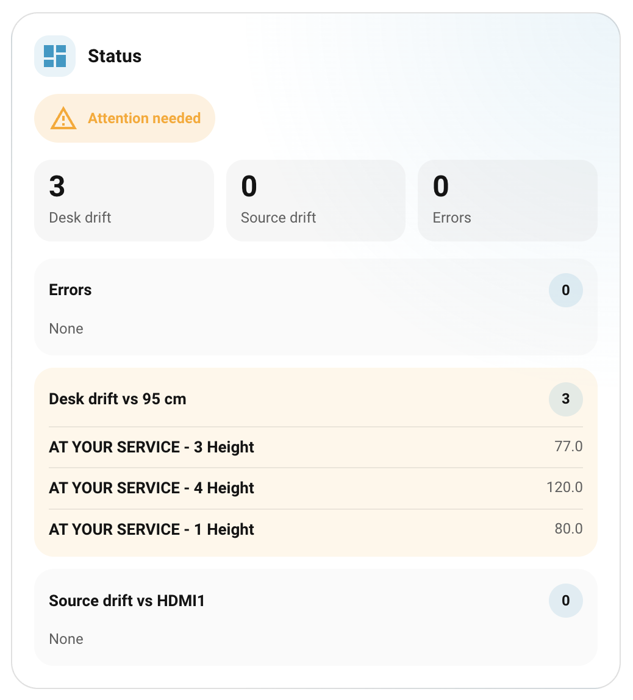

<p align="center">
  <picture>
    <source media="(prefers-color-scheme: dark)" srcset="https://raw.githubusercontent.com/MrGreenBoutiqueOffices/netlink-ha-cards/main/assets/logo/wordmark-dark.svg">
    <source media="(prefers-color-scheme: light)" srcset="https://raw.githubusercontent.com/MrGreenBoutiqueOffices/netlink-ha-cards/main/assets/logo/wordmark-light.svg">
    
  </picture>
</p>

<p align="center">
  Custom Home Assistant dashboard cards for NetLink sit-stand desks and displays.
</p>

<p align="center">
  <a href="https://github.com/MrGreenBoutiqueOffices/netlink-ha-cards/actions/workflows/linting.yaml">
    
  </a>
  <a href="LICENSE">
    
  </a>
  <a href="https://github.com/hacs/integration">
    
  </a>
</p>

---

## Installation

### HACS Custom Repository

[](https://my.home-assistant.io/redirect/hacs_repository/?owner=MrGreenBoutiqueOffices&repository=netlink-ha-cards&category=plugin)

1. Open HACS in Home Assistant.
2. Add this repository as a custom frontend repository.
3. Install `NetLink HA Cards`.

### Manual Installation

Copy the built file to your Home Assistant `www` folder and add:

```yaml
url: /local/netlink-ha-cards.js
type: module
```

---

## Cards

| Card                              | Element                               | Description                                                                       |
| --------------------------------- | ------------------------------------- | --------------------------------------------------------------------------------- |
| `custom:netlink-access-code-card` | [Access Code Card](#access-code-card) | Shows the current NetLink daily access code with expiry countdown and copy button |
| `custom:netlink-status-card`      | [Status Card](#status-card)           | Operational summary of desk height drift, display source drift, and active errors |

---

## Access Code Card



Displays the current NetLink daily access code for a given purpose. The card shows the code, its expiry time, a live countdown, a progress bar, and a warning badge when rollover is approaching.

### Configuration

| Option                    | Type     | Required | Default                | Description                                                |
| ------------------------- | -------- | -------- | ---------------------- | ---------------------------------------------------------- |
| `purpose`                 | `string` | Yes      | —                      | Access code purpose: `web_login` or `signing_maintenance`  |
| `title`                   | `string` | No       | Derived from `purpose` | Card title                                                 |
| `icon`                    | `string` | No       | Derived from `purpose` | Card icon (any `mdi:` icon)                                |
| `warningThresholdMinutes` | `number` | No       | `60`                   | Minutes before expiry at which the warning state activates |

### Example

```yaml
type: custom:netlink-access-code-card
purpose: web_login
title: Web login
icon: mdi:web
warningThresholdMinutes: 60
```

---

## Status Card



Provides a compact operational overview for a room, area, or site. It groups issues into three categories — desk height drift, display source drift, and active errors — and shows an overall severity banner.

Entity discovery works via HA labels. Explicit entity lists override label-based discovery when provided.

### Configuration

| Option                    | Type       | Required | Default    | Description                                                         |
| ------------------------- | ---------- | -------- | ---------- | ------------------------------------------------------------------- |
| `title`                   | `string`   | No       | `"Status"` | Card title                                                          |
| `target_desk_height`      | `string`   | No       | `"95 cm"`  | Expected desk height (e.g. `"72 cm"`)                               |
| `target_source`           | `string`   | No       | `"HDMI1"`  | Expected display source (e.g. `"HDMI2"`)                            |
| `desk_label`              | `string`   | No       | `"desk"`   | HA label used to discover desk height entities                      |
| `display_label`           | `string`   | No       | `"dell"`   | HA label used to discover display source entities                   |
| `error_labels`            | `string[]` | No       | `[]`       | HA labels used to discover error entities                           |
| `area_ids`                | `string[]` | No       | `[]`       | Scope discovery to specific HA areas. Empty = all areas             |
| `desk_height_entities`    | `string[]` | No       | `[]`       | Explicit entity IDs for desk heights (overrides `desk_label`)       |
| `display_source_entities` | `string[]` | No       | `[]`       | Explicit entity IDs for display sources (overrides `display_label`) |
| `error_entities`          | `string[]` | No       | `[]`       | Explicit entity IDs for errors (overrides `error_labels`)           |

### Example — label-based discovery (recommended)

```yaml
type: custom:netlink-status-card
title: Status
target_desk_height: 95 cm
target_source: HDMI1
desk_label: desk
display_label: dell
error_labels:
  - desk
  - dell
```

### Example — explicit entity lists

```yaml
type: custom:netlink-status-card
title: Room A
target_desk_height: 72 cm
target_source: HDMI2
desk_height_entities:
  - sensor.desk_a_height
  - sensor.desk_b_height
display_source_entities:
  - sensor.display_a_source
error_entities:
  - sensor.desk_a_error
  - sensor.display_a_error
```

---

## Development

See [DEVELOPMENT.md](DEVELOPMENT.md) for setup instructions and available commands.
